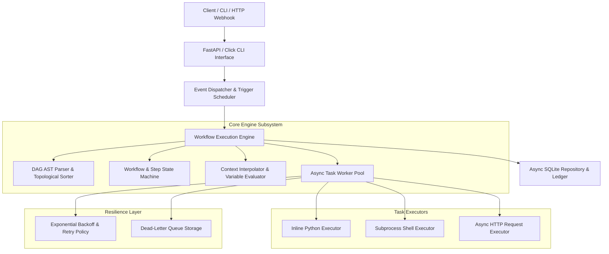

# Basalt — Embedded Event-Driven Workflow & DAG Execution Engine

[](https://www.python.org/downloads/)
[](LICENSE)
[](https://fastapi.tiangolo.com/)

**Basalt** is a production-grade, lightweight, embedded Directed Acyclic Graph (DAG) workflow orchestrator and event execution engine built for Python 3.12+. It enables developers to define, schedule, trigger, and execute complex multi-step automation workflows with strict state persistence, retry resilience, variable context interpolation, and step-level isolation.

Basalt operates completely self-contained in-process or backed by a local SQLite database without requiring external message brokers (such as Redis, RabbitMQ, or Celery) or cloud infrastructure.

---

## Key Features

* 🔄 **DAG AST & Topological Engine:** JSON/YAML/Python DSL parsing with topological sorting (Kahn's algorithm / DFS) and automatic cycle detection.
* ⚡ **Asynchronous Step Worker Pool:** Concurrent step execution using `asyncio` semaphores and thread pool executors.
* 🛠️ **Pluggable Executors:** Built-in task executors for **Inline Python functions**, **Subprocess Shell commands**, and **Async HTTP requests**.
* 🔍 **Context & Expression Interpolation:** Dynamic variable resolution supporting template expressions like `${steps.fetch_data.output.id}` and `${env.API_KEY}`.
* 🛡️ **Resilience & Fault Tolerance:** Exponential backoff with jitter, step retry policies, circuit breakers, and a persistent Dead-Letter Queue (DLQ).
* ⏰ **Event Triggers & Scheduler:** 5-field Cron schedules, fixed interval timers, and incoming HTTP Webhook ingestion with HMAC verification.
* 💾 **SQLite Audit Ledger:** Async SQLAlchemy 2.0 database layer storing complete run histories, step outputs, and execution metrics.
* 🌐 **Dual Interface:** REST API powered by FastAPI and a command-line interface (CLI) powered by Click.

---

## Architecture Overview



---

## Codebase Structure

```
basalt/
├── Dockerfile                  # Production Docker container definition
├── Makefile                    # Production Makefile for build, test, lint, clean & docker
├── pyproject.toml              # Build backend, package metadata & tool configs
├── requirements.txt            # Pinned dependencies
├── README.md                   # System documentation
├── PLAN/                       # System specification & execution plan
│   ├── REQUIREMENTS.MD         # Requirements specification
│   ├── DESIGN.MD               # System architecture & file map
│   └── PLAN.MD                 # Master implementation checklist
├── src/basalt/                 # Primary source code directory
│   ├── core/                   # Engine, DAG parser, executors, triggers, resilience
│   │   ├── dag/                # AST, parser, validator, topological sorter
│   │   ├── engine/             # Runner, state machine, context, evaluator, hooks
│   │   ├── executors/          # Base, inline, subprocess, http, worker pool
│   │   ├── triggers/           # Base, cron, interval, webhook, dispatcher
│   │   └── resilience/         # Backoff, retry handler, circuit breaker, DLQ
│   ├── storage/                # SQLite database, SQLAlchemy models, repository
│   ├── api/                    # FastAPI application, routers, schemas, middleware
│   ├── cli/                    # Click CLI commands and formatters
│   └── utils/                  # Config, logger, crypto, time, validators
└── tests/                      # Unit, integration, API, and CLI test suite
```

---

## Quickstart & Installation

### Local Setup

1. **Clone the repository and navigate to `basalt`:**
   ```bash
   cd basalt
   ```

2. **Create and activate a Python 3.12 virtual environment:**
   ```bash
   python3.12 -m venv .venv
   source .venv/bin/activate
   ```

3. **Install dependencies and `basalt` in editable mode:**
   ```bash
   pip install -e ".[dev]"
   ```

4. **Verify CLI installation:**
   ```bash
   basalt --help
   ```

### Docker Setup

Build and run Basalt in a reproducible Docker container:

```bash
docker build -t basalt:latest .
docker run -p 8000:8000 basalt:latest
```

---

## Command Line Interface (CLI)

Basalt provides a rich command-line tool `basalt`:

```bash
# Validate a DAG workflow file
basalt dag validate workflow.yaml

# List registered DAG definitions
basalt dag list

# Execute a DAG workflow locally
basalt run start workflow.yaml

# Check the status of a specific workflow run
basalt run status <run_id>

# View execution logs for a workflow run
basalt run logs <run_id>

# Start the REST API server
basalt server start --host 0.0.0.0 --port 8000
```

---

## REST API Reference

When the REST server is running (`strata server start`), interactive Swagger documentation is available at `http://localhost:8000/docs`.

### Main Endpoints

| Method | Endpoint | Description |
| :--- | :--- | :--- |
| `POST` | `/api/v1/dags/` | Register a new DAG definition |
| `GET` | `/api/v1/dags/` | List all registered DAG definitions |
| `GET` | `/api/v1/dags/{dag_id}` | Get DAG definition details |
| `POST` | `/api/v1/dags/{dag_id}/runs` | Trigger execution of a DAG run |
| `GET` | `/api/v1/runs/{run_id}` | Get workflow run status and step logs |
| `POST` | `/api/v1/runs/{run_id}/cancel` | Cancel an active workflow run |
| `POST` | `/api/v1/webhooks/{trigger_id}` | Ingest incoming HTTP webhook event |

---

## Makefile Quick Reference

Basalt includes a production-grade `Makefile` for streamlined development, testing, and container management:

| Command | Description |
| :--- | :--- |
| `make help` | Display available targets and descriptions |
| `make install` | Install production dependencies and package |
| `make dev-install` | Install package with all development dependencies (`pytest`, `mypy`, `ruff`) |
| `make test` | Execute complete unit and integration test suite |
| `make test-cov` | Execute test suite with terminal code coverage report |
| `make lint` | Run static code analysis (`ruff` and `mypy`) |
| `make format` | Auto-format source code using `ruff` |
| `make clean` | Recursively clean `__pycache__`, `.pytest_cache`, `.mypy_cache`, and build artifacts |
| `make doctor` | Run system diagnostics and verify environment dependencies |
| `make docker-build` | Build production Docker container image (`basalt:latest`) |
| `make docker-run` | Run production Docker container binding port 8000 |
| `make server` | Launch local REST API server |

---

## Testing & Quality Assurance

Run the comprehensive test suite using `make` or `pytest`:

```bash
# Run all unit and integration tests via Makefile
make test

# Run tests with code coverage report
make test-cov

# Run type checking and code linting
make lint

# Run system environment diagnostics
make doctor

# Run tests emitting CTRF report for automated pipeline grading
pytest --json-report --json-report-file=ctrf-report.json
```

